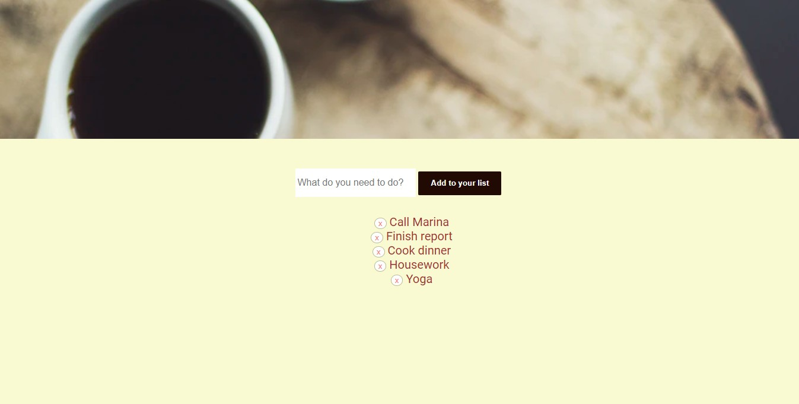

<h1>To Do List</h1>

<h2> A list to control activities to be done </h2>

 https://todozm.netlify.app/ 

<h3>Functionalities</h3>
<ol>
  <li> Create an activity  </li>
  <li> Delete activity from the list </li>
</ol>

<h3>Tools</h3>

HTML, CSS and JS

<h3>Result</h3>

